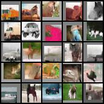
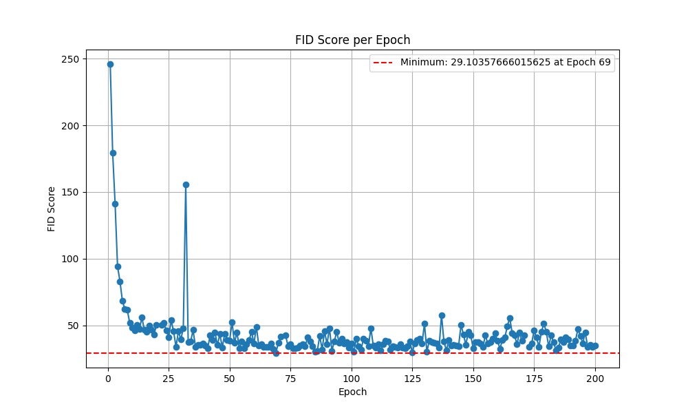
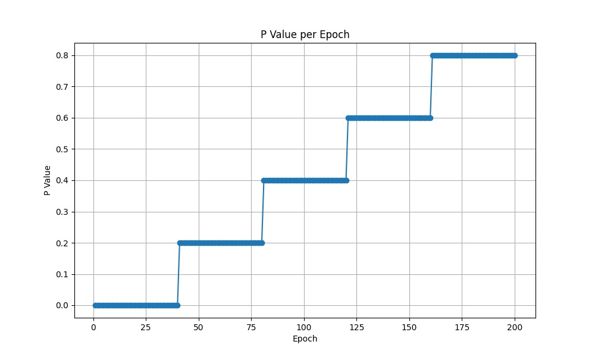
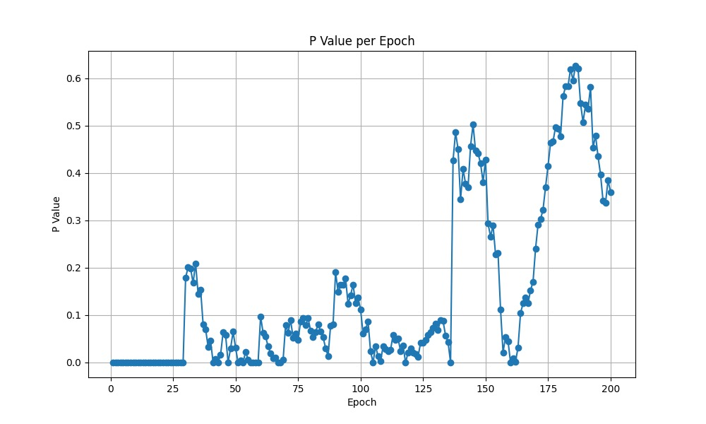
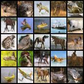
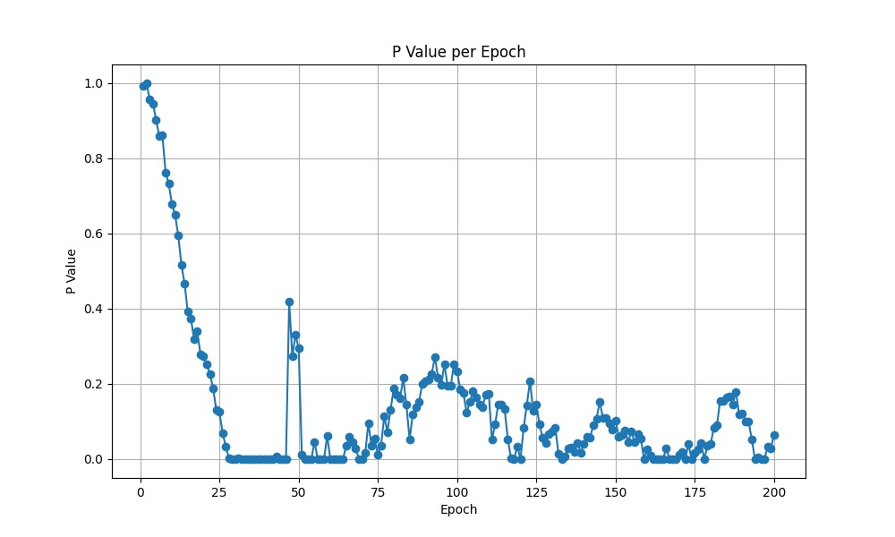
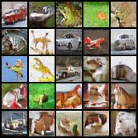

# Enhancing TransGAN with Adaptive Data Augmentation (ADA) for CIFAR-10

## Overview

This project aims to enhance a traditional TransGAN model by integrating Adaptive Data Augmentation (ADA) techniques to evaluate their impact on the model's performance. The primary goal is to assess whether ADA can reduce artifact leakage in generated images and improve the overall fidelity of the model, as measured by the Fréchet Inception Distance (FID). The was our final assigment in our Deep Generative Course.

## Table of Contents
- [Abstract](#abstract)
- [Introduction and Background](#introduction-and-background)
- [Methodology](#methodology)
  - [CIFAR-10 Dataset](#cifar-10-dataset)
  - [Code Adaptation](#code-adaptation)
  - [Hyperparameters](#hyperparameters)
  - [Model Configuration](#model-configuration)
- [Results and Discussion](#results-and-discussion)
  - [FID Scores](#fid-scores)
  - [Discussion and Conclusion](#discussion-and-conclusion)
- [References](#references)
- [Metrics and Sampled Images](#metrics-and-sampled-images)

## Abstract

This study enhances a traditional TransGAN model by integrating Adaptive Data Augmentation (ADA) techniques to evaluate their impact on the model's performance. The primary goal was to assess whether ADA can reduce artifact leakage in generated images and how it affects the overall fidelity of the model, as measured by the Fréchet Inception Distance (FID).

## Methodology

### CIFAR-10 Dataset

We chose the CIFAR-10 dataset for training and testing due to our computational limitations and its provision of small-sized images (32x32). CIFAR-10, consisting of 60,000 32x32 color images in 10 classes, is widely used for machine learning research. Its diverse and balanced dataset makes it ideal for training and testing innovative GAN architectures.

### Code Adaptation

The original code was modified to integrate ADA (Adaptive Data Augmentation).
This integration involved embedding control mechanisms within the training loop to adjust the probability \( p \) of applying data augmentation.
Traditionally, TransGAN implementations apply augmentation to every image throughout the training process. To refine this approach, we introduced a variable \( p \), which dictates whether a given augmentation should be applied to an image.

The ADA logic, as detailed in the "Training GANs with Limited Data" paper, was implemented to reduce augmentation artifacts and improve the convergence behavior of the GAN. We utilized the \( r_v \) heuristic for updating \( p \) as follows:

\[ p_{	ext{new}} = p + \lambda 	imes (r_v - 	ext{target}) \]

Here, \( \lambda \) (set to 0.05 in our experiments) is a tuning parameter that determines the adjustment rate of \( p \), and \( 	ext{target} \) is the desired balance point for \( r_v \), typically set to 0.6. This value represents a balance where the discriminator's performance on the validation set is neither overfitted nor underfitted compared to its performance on the training and generated data. The value of \( r_v \) is calculated by:

\[ r_v = rac{|E[D_{	ext{train}}] - E[D_{	ext{validation}}]|}{|E[D_{	ext{train}}] - E[D_{	ext{generated}}]|} \]

### Hyperparameters

The following hyperparameters were used in our experiments:

- Batch size: 32
- Number of epochs: 200
- Optimizer: Adam (beta1: 0, beta2: 0.999)
- Loss Function: WGAN-GP
- Augmentation Used: Translation, Cutout, and Color
- \( p_{	ext{initial}} \) for ADA: 0 (dynamic), 1 (baseline and early-stage ADA)

These parameters were kept constant across all experiments to isolate the effects of ADA from any other variable changes.

### Model Configuration

- **Baseline Model (Test 1):** No ADA; always use augmentation (P=1).
- **Augmentation Incrementation (Test 2):** Initiate training with P=0 and increase it by 0.2 every 40 epochs.
- **Dynamic ADA Model (Test 3):** ADA initialized at P=0, with P dynamically adjusted based on the discriminator's feedback.
- **Early-Stage ADA Model (Test 4):** ADA initialized at P=1 to ensure augmentation during early training phases.

## Results and Discussion

### FID Scores

| Methods                         | FID (lower is better) |
|---------------------------------|-----------------------|
| Test 1 (Baseline)               | 27.68                 |
| Test 2 (Augmentation Incrementation) | 29.15           |
| Test 3 (Dynamic ADA Model)      | 26.42                 |
| Test 4 (Early-Stage ADA Model)  | 24.00                 |

### Discussion and Conclusion

As the results show, the use of adaptive data augmentation (ADA) enhanced the performance of the TransGAN model. Among the different approaches tested, the early-stage ADA model provided the best results. However, the overall differences in Fréchet Inception Distance (FID) scores across the models were not significant. We suspect this lack of pronounced improvement in FID might be due to unoptimized hyperparameters and compute limitations, which prevented us from fully maximizing the model's potential.

Despite this, we observed a significant reduction in augmentation leakage while using ADA, particularly noticeable in the dynamic ADA model. This reduction in leakage suggests that ADA helps in maintaining the integrity of generated images by minimizing unrealistic artifacts. We believe that with a better experimental setup and optimized hyperparameters, ADA could achieve even better results than those reported in the original TransGAN paper.

## References

- [Original TransGAN Paper](https://arxiv.org/pdf/2102.07074)
- [Original Training GAN With Limited Data Paper](https://arxiv.org/pdf/2006.06676)
- [TransGAN Implementation](https://github.com/asarigun/TransGAN)

## Metrics and Sampled Images

### Test 1 (Baseline Model)

### Test 2 (Augmentation Incrementation Model)

### Test 3 (Dynamic ADA Model)

### Test 4 (Early-Stage ADA Model)

